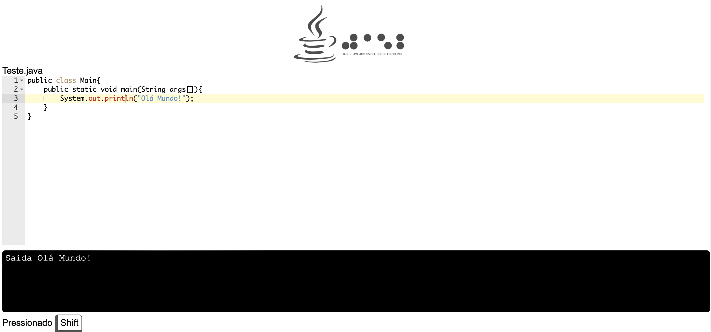
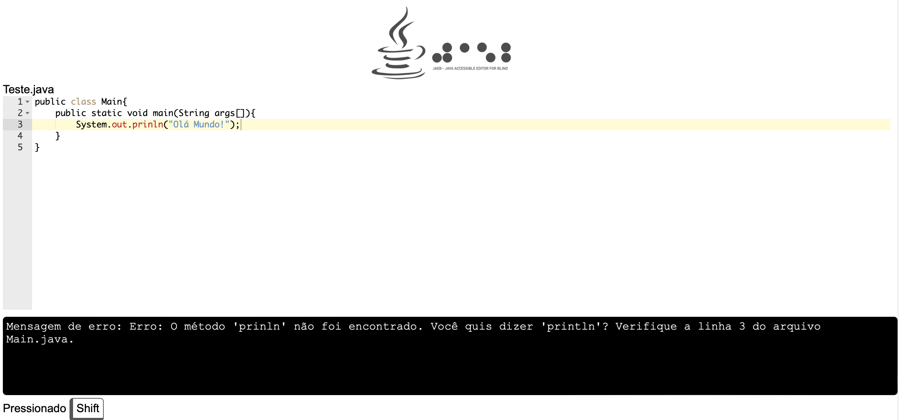
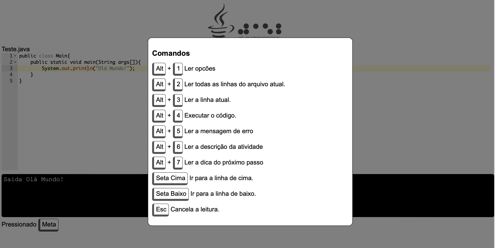

# JAEB-Java-Accessible-Editor-for-Blind
A Java Editor Accessible to the Blind Using LLM and the Web Speech API. This tool was developed using HTML technologies. JAEB offers several features designed for blind users, such as speaking error messages, reading output, announcing typed characters and deleted content, narrating navigation (e.g., start and end of a line), and checking if a line is blank.

## Technologies:

* Hightlight lines editor (https://highlightjs.org)

* Speeking codes (https://github.com/juancamposlb/ResponsiveVoice)

* ChatGPT API (https://openai.com/api/)

* Speech Text (https://responsivevoice.org)

## Screens

Error Message

Output

Commands List
